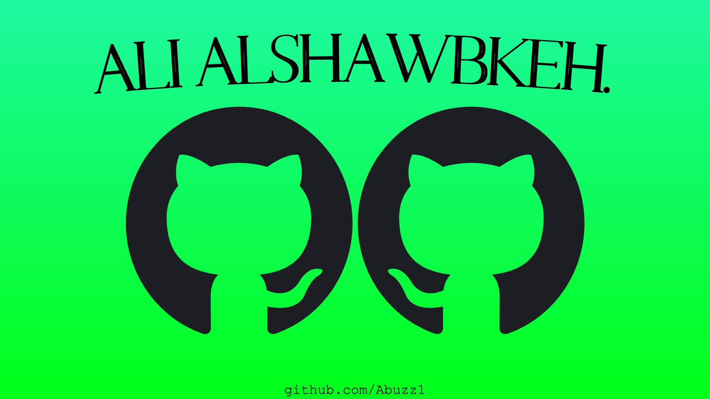

- 👋 Hi, I’m @Abuzz1
- 👀 I’m interested in AI and data science.
- 🌱 I’m currently learning R
- 📫 How to reach me alialshawabkeh12@gmail.com

Best Regards,
Ali Alshawabkeh

<!---
Abuzz1/Abuzz1 is a ✨ special ✨ repository because its `README.md` (this file) appears on your GitHub profile.
You can click the Preview link to take a look at your changes.
--->
